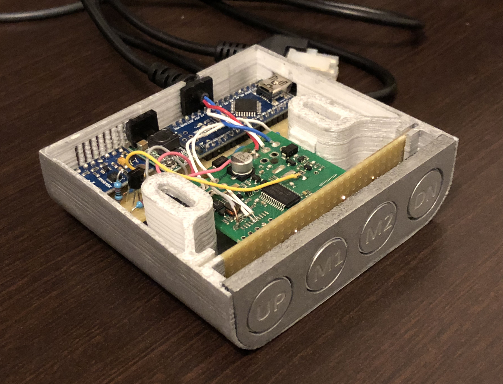
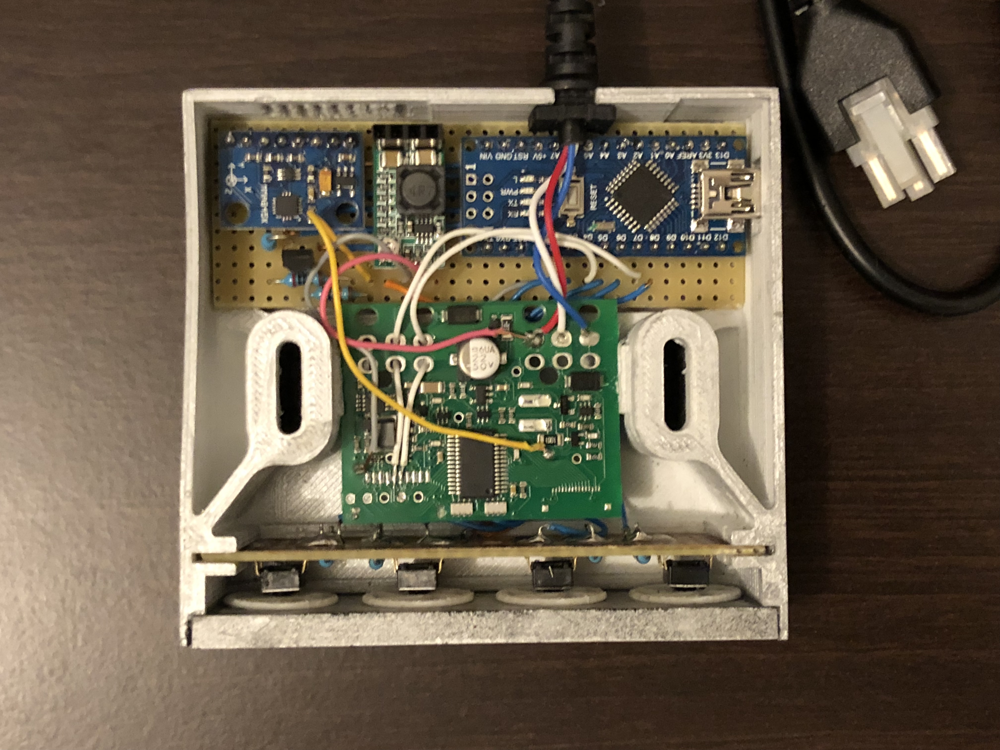
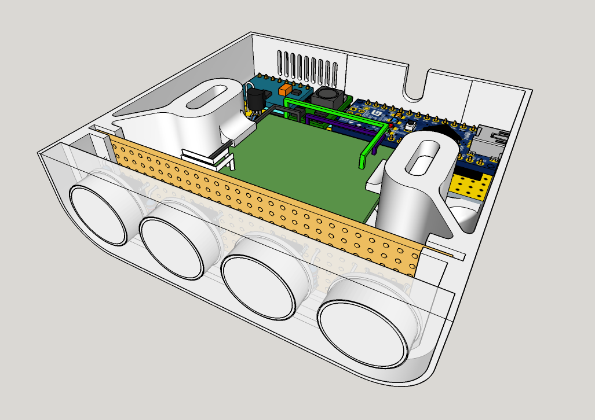

# IKEA Bekant plus

Ikea Bekant controler hack to add 2 memory button, inspired by https://github.com/robin7331/IKEA-Hackant

- 3D-Printed case and button supports
- Laser cut front panel
- Laser cut and engraved buttons
- Accelerometer for experimental collision detection

### Materials

- IKEA Bekant spare controller, available from IKEA's customer service under reference 138683 to keep the original safe.
- Arduino Uno V3
- [DC~DC 24V to 5V adjustable step down power converter](http://www.ebay.fr/itm/1-2-5PCS-DC-DC12-24V-To-5V-3A-Adjustable-Step-Down-Power-Module-Buck-Converter/263084765079?ssPageName=STRK%3AMEBIDX%3AIT&var=562083201613&_trksid=p2057872.m2749.l2649)
- [GY-45 MMA8451 3-axis accelerometer](http://www.ebay.fr/itm/GY-45-MMA8451-Accelerometre-3-Axes-14-bit-8-bit-haute-resolution-Arduino-Pi-pro/282528348426?ssPageName=STRK%3AMEBIDX%3AIT&_trksid=p2057872.m2749.l2649)
- [Vero strip-board](http://www.ebay.fr/itm/Stripboard-Vero-Strip-Prototyping-Board-Various-Sizes-1st-CLASS-POST/291193969819?ssPageName=STRK%3AMEBIDX%3AIT&var=590350244401&_trksid=p2057872.m2749.l2649)

